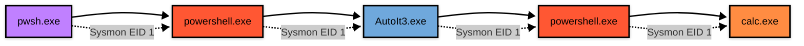

# [Command and Scripting Interpreter: PowerShell] - Detection Engineering
PowerShell es una solución de automatización de tareas multiplataformas formada por un shell de líneas de comandos, un lenguaje de scripting y un marco de administración de configuración. PowerShell funciona en Windows 10-11, Linux y macOs. Los adversarios usan PowerShell para un numero considerable de acciones, incluyendo descubrimiento de información, ejecución de código, conexiones remotas e inclusive descargar ejecutables de internet, powerShell se basa en .NET por lo que las entradas y salidas son objetos .NET a su vez que tiene Common Languague Runtime (CLR).  

## Metadata
| Campo | Valor |
|-------|-------|
| **MITRE ATT&CK** | [T1059.001](https://attack.mitre.org/techniques/T1059/001/) |
| **Tactic** | Execution |
| **Platform** | Windows 10 Education 22H2 |
| **Data Sources** | Sysmon (EID X, Y, Z),  |
| **Estado del EndPoint**| Firewall desactivado, AV desactivado| 
| **Dificultad de detección** | 🟢 Baja |
| **Última actualización** | 2025/11/23 |


## Contexto de Amenaza

### ¿Por qué es relevante esta técnica?
Los adversarios han usado PowerShell a lo largo de muchos años para realizar sus ataques debido a un factor importante y es el hecho de que ya viene por defecto en la mayoria de sistemas Windows, lo que les facilita a la hora de recolección de credenciales, escalada de privilegios, ejecución de payloads entre otras funciones mas.

### Grupos APT Conocidos

| Grupo | Campaña | Año | Referencia |
|-------|---------|-----|------------|
| [Sandworm Team](https://attack.mitre.org/groups/G0034/) | 2022 Ukraine Electric Power Attack | 2022 | [Informe Campaña](https://attack.mitre.org/campaigns/C0034/) |
| [APT28](https://attack.mitre.org/groups/G0007/) | Nearest Neighbor Campaign | 2022 - 2024 | [Informe Campaña](https://attack.mitre.org/campaigns/C0051/) |
| [Lazarus Group](https://attack.mitre.org/groups/G0032/) | Operation Dream Job | 2019 | [Informe Campaña](https://attack.mitre.org/campaigns/C0022/) |

### Kill Chain

```mermaid
---
config:
  look: neo
  theme: neo
---
graph LR
    %% Cyber Kill Chain
    A[Recon] --> B[Initial Access]
    B --> C[Execution]
    C --> D[Persistence]
    D --> E[Privilege Escalation]
    E --> F[Defense Evasion]
    F --> G[Credential Access]
    G --> H[Discovery]
    H --> I[Lateral Movement]
    I --> J[Collection]
    J --> K[Exfiltration]
    K --> L[Impact]    
    style C fill:#ff6b6b

```



## Diagrama de Ataque

### Attack Flow Completo - Atomic Red Team Example


---
## Variantes de la Técnica


## Impacto Operacional

### Hipótesis de Hunting


## Configuración del Laboratorio

### Requisitos del Entorno

**Máquina víctima:**
- OS: Windows 10 22H2
- RAM: 4GB mínimo
- CPU: 2 vCPUs
- Disk: 60GB

**Máquina atacante:**
- 
- Tools: [Lista de herramientas necesarias]

**Servidor de monitoreo:**
- 
- 
- 
- 

### Diagrama de Red
```mermaid
graph LR
    
```
## Simulación controlada

### Artefactos generados

| Paso | Artefacto | Ubicación | Persistencia |
|------|-----------|-----------|--------------|
| 1 |  |  |  |
| 2 |  |  |  |
| 3 |  |  |  |
| 4 |  |  |  |
| 5 |  |  |  |

## Desarrollo de Detección

### Regla Sigma (Universal)
### Traducción a Wazuh (Rules)

## Testing & Validación
### Prueba 1:
### Prueba 2:
### Prueba 3:
### Prueba 4:

### Matriz de validación

| Escenario | Regla esperada | Level | ¿Detectó? | Notas |
|-----------|----------------|-------|-----------|-------|
|  |  | |  |  |
|  |  | |  |  |
|  |  | |  |  |
|  |  | |  |  |
|  |  | |  |  |

## Validación con herramientas

## Iteración y mejora

## Acciones Recomendadas

## Referencias
- [¿Qué es PowerShell? - Learn Microsoft](https://learn.microsoft.com/es-es/powershell/scripting/overview?view=powershell-7.5)
- [Introducción a Common Language Runtime (CLR)](https://learn.microsoft.com/es-es/dotnet/standard/clr)
-
-

---
[←Ver Técnicas Individuales](../techniques/index.md)\
[← Volver al inicio](../index.md)