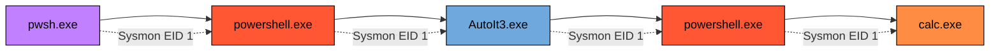
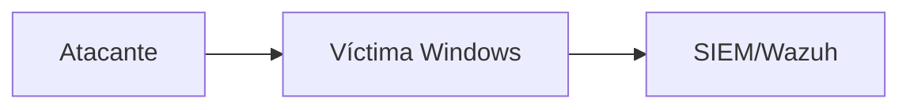

# Command and Scripting Interpreter: PowerShell - Detection Engineering

PowerShell es una solución de automatización de tareas multiplataformas formada por un shell de líneas de comandos, un lenguaje de scripting y un marco de administración de configuración. PowerShell funciona en Windows 10-11, Linux y macOS. Los adversarios usan PowerShell para un número considerable de acciones, incluyendo descubrimiento de información, ejecución de código, conexiones remotas e inclusive descargar ejecutables de internet. PowerShell se basa en .NET por lo que las entradas y salidas son objetos .NET a su vez que tiene Common Language Runtime (CLR).

## Metadata

| Campo | Valor |
|-------|-------|
| **MITRE ATT&CK** | [T1059.001](https://attack.mitre.org/techniques/T1059/001/) |
| **Tactic** | Execution |
| **Platform** | Windows 10 Education 22H2 |
| **Data Sources** | Sysmon (EID 1, 3, 7) |
| **Estado del EndPoint** | Firewall desactivado, AV desactivado |
| **Dificultad de detección** | 🟢 Baja |
| **Última actualización** | 2025/11/23 |

## Contexto de Amenaza

### ¿Por qué es relevante esta técnica?

Los adversarios han usado PowerShell a lo largo de muchos años para realizar sus ataques debido a un factor importante y es el hecho de que ya viene por defecto en la mayoría de sistemas Windows, lo que les facilita la recolección de credenciales, escalada de privilegios, ejecución de payloads entre otras funciones.

### Grupos APT Conocidos

| Grupo | Campaña | Año | Referencia |
|-------|---------|-----|------------|
| [Sandworm Team](https://attack.mitre.org/groups/G0034/) | 2022 Ukraine Electric Power Attack | 2022 | [Informe](https://attack.mitre.org/campaigns/C0034/) |
| [APT28](https://attack.mitre.org/groups/G0007/) | Nearest Neighbor Campaign | 2022-2024 | [Informe](https://attack.mitre.org/campaigns/C0051/) |
| [Lazarus Group](https://attack.mitre.org/groups/G0032/) | Operation Dream Job | 2019 | [Informe](https://attack.mitre.org/campaigns/C0022/) |

### Kill Chain

```mermaid
graph LR
    A[Recon] --> B[Initial Access]
    B --> C[Execution]
    C --> D[Persistence]
    D --> E[Privilege Escalation]
    E --> F[Defense Evasion]
    F --> G[Credential Access]
    G --> H[Discovery]
    H --> I[Lateral Movement]
    I --> J[Collection]
    J --> K[Exfiltration]
    K --> L[Impact]    
    style C fill:#ff6b6b
```

## Diagrama de Ataque

### Attack Flow Completo - Atomic Red Team Example

## Variantes de la Técnica

*(Contenido pendiente)*

## Impacto Operacional

### Hipótesis de Hunting

*(Contenido pendiente)*

## Configuración del Laboratorio

### Requisitos del Entorno

**Máquina víctima:**
- OS: Windows 10 22H2
- RAM: 4GB mínimo
- CPU: 2 vCPUs
- Disk: 60GB

**Máquina atacante:**
- *(Pendiente)*

**Servidor de monitoreo:**
- *(Pendiente)*

### Diagrama de Red

## Simulación Controlada

### Artefactos Generados

| Paso | Artefacto | Ubicación | Persistencia |
|------|-----------|-----------|--------------|
| 1 | *(Pendiente)* | *(Pendiente)* | *(Pendiente)* |

## Desarrollo de Detección

### Regla Sigma (Universal)

*(Contenido pendiente)*

### Traducción a Wazuh (Rules)

*(Contenido pendiente)*

## Testing & Validación

### Matriz de Validación

| Escenario | Regla esperada | Level | ¿Detectó? | Notas |
|-----------|----------------|-------|-----------|-------|
| *(Pendiente)* | *(Pendiente)* | *(Pendiente)* | *(Pendiente)* | *(Pendiente)* |

## Acciones Recomendadas

*(Contenido pendiente)*

## Referencias

- [¿Qué es PowerShell? - Microsoft Learn](https://learn.microsoft.com/es-es/powershell/scripting/overview?view=powershell-7.5)
- [Introducción a Common Language Runtime (CLR)](https://learn.microsoft.com/es-es/dotnet/standard/clr)

---

[← Ver Técnicas Individuales](../index.md) | [← Volver al inicio](../../index.md)