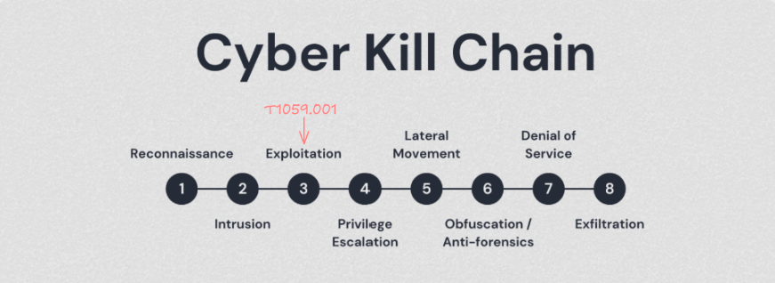
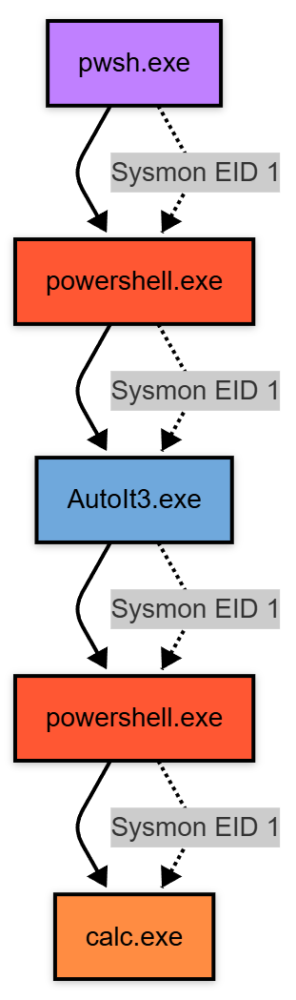
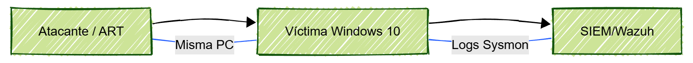
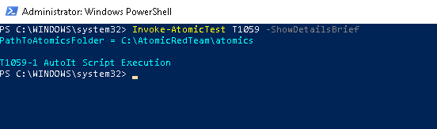
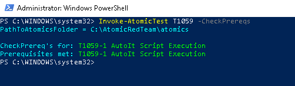
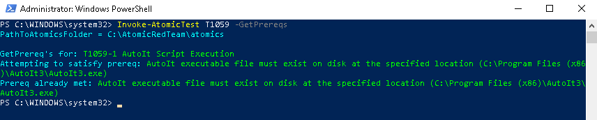
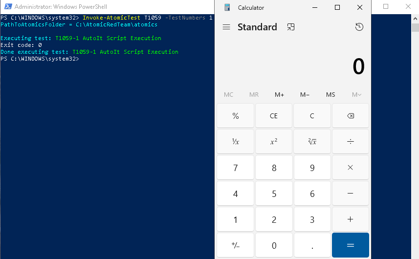
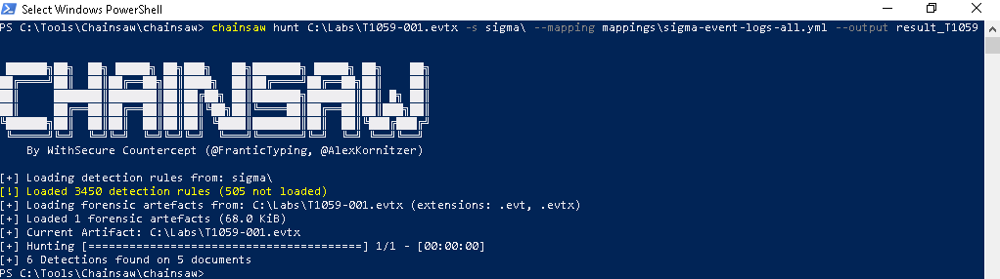

# Command and Scripting Interpreter: PowerShell - Detection Engineering

PowerShell es una solución de automatización de tareas multiplataformas formada por un shell de líneas de comandos, un lenguaje de scripting y un marco de administración de configuración. PowerShell funciona en Windows 10-11, Linux y macOS. Los adversarios usan PowerShell para un número considerable de acciones, incluyendo descubrimiento de información, ejecución de código, conexiones remotas e inclusive descargar ejecutables de internet. PowerShell se basa en .NET por lo que las entradas y salidas son objetos .NET a su vez que tiene Common Language Runtime (CLR).

## Metadata

| Campo | Valor |
|-------|-------|
| **MITRE ATT&CK** | [T1059.001](https://attack.mitre.org/techniques/T1059/001/) |
| **Tactic** | Execution |
| **Platform** | Windows 10 Education 22H2 |
| **Data Sources** | Sysmon (EID 1, 3, 7) |
| **Estado del EndPoint** | Firewall desactivado, AV desactivado |
| **Dificultad de detección** | 🟢 Baja |
| **Última actualización** | 2025/11/23 |

## Contexto de Amenaza

### ¿Por qué es relevante esta técnica?

Los adversarios han usado PowerShell a lo largo de muchos años para realizar sus ataques debido a un factor importante y es el hecho de que ya viene por defecto en la mayoría de sistemas Windows, lo que les facilita la recolección de credenciales, escalada de privilegios, ejecución de payloads entre otras funciones.

### Grupos APT Conocidos

| Grupo | Campaña | Año | Referencia |
|-------|---------|-----|------------|
| [Sandworm Team](https://attack.mitre.org/groups/G0034/) | 2022 Ukraine Electric Power Attack | 2022 | [Informe](https://attack.mitre.org/campaigns/C0034/) |
| [APT28](https://attack.mitre.org/groups/G0007/) | Nearest Neighbor Campaign | 2022-2024 | [Informe](https://attack.mitre.org/campaigns/C0051/) |
| [Lazarus Group](https://attack.mitre.org/groups/G0032/) | Operation Dream Job | 2019 | [Informe](https://attack.mitre.org/campaigns/C0022/) |

### Kill Chain

## Diagrama de Ataque

### Attack Flow Completo - Atomic Red Team Example

## Variantes de la Técnica

| Nombre Técnica | Id Técnica | Referencia |  
|-------|---------|-----|
| AppleScript | T1059.002 | [Link](https://attack.mitre.org/techniques/T1059/002/) | 
| JavaScript (JS) | T1059.007 | [Link](https://attack.mitre.org/techniques/T1059/007/) | 
| VisualBasic (VB) | T1059.005 | [Link](https://attack.mitre.org/techniques/T1059/005/) | 

## Impacto Operacional
El impacto operacional de esta técnica puede variar mucho ya que depende de los objetivos del atacante sobre la victima, mas sin embargo el impacto que genera independientemente es enorme debido a que con el uso de PowerShell el atacante puede realizar muchas acciones, dentro de estas podrían ser el poder evitar políticas de seguridad para moverse lateral o verticalmente, ejecución de comandos y payloads, descubrimiento de hosts, persistencia, comprometer credenciales, obtención de información sobre DNS, shell reversas y descarga de malware via internet.

### Hipótesis de Hunting

**Hipótesis:** Si observas a PowerShell ejecutándose con flags de ofuscación (-EncodedCommand, -WindowsStyle Hidden), ParentProcess inusuales, modulos raros cargados, conexiones o descarga de artefactos de la red, Aparición de ChildProcess que no deberían estar, procesos inusuales o cargando procesos gestionados (.NET), podría indicar intentos de ejeción de payloads maliciosos.

## Configuración del Laboratorio

### Requisitos del Entorno

**Máquina víctima:**
- OS: Windows 10 22H2 Education
- RAM: 4GB mínimo
- CPU: 2 vCPUs
- Disk: 80GB
- VMware WorkStation 17 Pro

**Máquina atacante:**
- Se utiliza la misma maquina victima para correr las pruebas con Atomic Red Team (ART)
- Recomiendo seguir la guía de instalación de la fuente oficial de ART: [Guia Instalación ART](https://github.com/redcanaryco/invoke-atomicredteam/wiki/Installing-Invoke-AtomicRedTeam)

**Servidor de monitoreo:**
- Wazuh v4.14.0 para Docker en maquina Host Windows 11 Home Single Language 25H2 con Version Single-node para Wazuh el stack ya cuenta con (Indexer,Container, Dashboard)
- Para conocer los requisitos necesarios para Wazuh en la versión que se usara en este proyecto, recomeindo seguir la guía de instalación de la fuente oficial: [Guia Instalacion Wazuh-Docker vSingle-node stack](https://documentation.wazuh.com/current/deployment-options/docker/wazuh-container.html)

**Recolección de Logs y Herramientas**
- System Monitor (Sysmon v15.15) - [Instalación Sysmon](https://learn.microsoft.com/en-us/sysinternals/downloads/sysmon)
- SwiftOnSecurity - Configuración para Symon - [Instalación SwiftOnSecutity](https://github.com/SwiftOnSecurity/sysmon-config)
- Chainsaw usada para detección usando reglas Sigma - [Instalación Chainsaw](https://github.com/WithSecureLabs/chainsaw)
- Utilidad para Sysmon para Analizar, Visualizar y Gestionar Logs de Sysmon - [Instalación Sysmon Tools](https://github.com/nshalabi/SysmonTools)

### Diagrama de Red

## Simulación Controlada
Si desea consultar mas detalles sobre como ejecutar las pruebas que haremos en este laboratorio le recomiendo ir al Sitio Web Oficial de RedCanary: [Web Oficial RedCanary](https://github.com/redcanaryco/invoke-atomicredteam/wiki/List-Atomic-Tests) continuando con la prueba, en este caso nuestro interés es para [T1059.001 - PowerShell](https://attack.mitre.org/techniques/T1059/001/) podemos listarlo en Atomic Red Team desde nuestro PowerShell con el siguiente comando: `Invoke-AtomicTest -T1059 -ShowDetailsBrief` esto listara todos los tests disponibles para dicha técnica, en este caso solo encontramos una disponible que corresponde a **T1059.001 - PowerShell**.

Es importante que concidere siempre que para cada prueba hay una lista de Requisitos, puede consultarlos con el siguiente comando: `Invoke-AtomicTest -T1059 -CheckPrereqs`

Una vez conocidos los requisitos necesarios procederemos a la descarga para poder realizar nuestra prueba, podemos hacerlo con el siguiente comando: `Invoke-AtomicTest -T1059 -GetPrereqs`

Antes de ejecutar la prueba, me gustaría recalcar que se cree varias carpetas en el disco local **C:\\**
- **Carpeta Tools:** Guardaremos las 2 herramientas principales, **Chainsaw** y **Sysmon Tools**
- **Carpeta Logs:** Guardaremos los Logs que vamos a capturar haciendo uso de **Sysmon Tools** que son xml.
- **Carpeta Labs:** Guardaremos los .evtx en esta carpeta.

Algo que me gusta hacer siempre, debido a que me encuentro actualmente en fase de aprendizaje frente a la integración de multiples herramientas, análisis, correlación y comprensión de las pruebas que hacemos es limpiar los logs generados por **Sysmon**, esto nos ayuda de inicio a enfocarnos en las pruebas e ir mejorando progresivamente, a medida que avanzamos en los labs que y Cases seleccionados aumentaremos la dificultad para ir mejorando, tomando  buenos referentes como **Bots de Splunk**, Ataques Completos con **Atomic Red Team** o **Caldera MITRE**.

Para limpiar los Logs se hace con este comando: `wevtutil cl Microsoft-Windows-Sysmon/Operational` (wevtutil viene por defecto en Windows)que por si se esta preguntando el porque de la ruta, y es que allí se encuentran por defecto estos Logs, le recomiendo memorizarla ya que seguramente la necesitara. Otro TIP importante es que si desea ver los logs de **Sysmon** en vivo, puede hacerlo con **Event viewer** (Visor de Eventos) siguiendo esta ruta: `Applications and Services Logs -> Microsoft -> Windows -> Sysmon -> Operational`

Para ejecutar la prueba puede usar el comando `Invoke-AtomicTest -T1059 -TestNumbers 1`, si la ejecución fue exitosa le mostrara algo como esto:

Luego de ejecutar cualquier prueba le recomiendo esperar un tiempo para antes de capturar los Logs y analizar, para ello ejecute el siguiente comando: `Start-Sleep -Seconds 30`. Luego de ese tiempo capturaremos los datos y los enviaremos a nuestras carpetas correspondientes:

- **[Captura1]:** `wevtutil epl "Microsoft-Windows-Sysmon/Operational" C:\Labs\T1059-001.evtx` 
- **[Captura2]:** `wevtutil query-events "Microsoft-Windows-Sysmon/Operational" /format:xml /e:sysmonview > C:\Logs\T1059-001.xml`

### Análisis con Chainsaw

Antes de analizar con Chainsaw le recomiendo estar en la carpeta donde tiene la herramienta instalada, si ha seguido las recomendaciones de este tutorial, debería estar en `C:\Tools\Chainsaw\chainsaw\` y desde allí podemos analizar el archivo **T1059-001.evtx** que guardamos en **Labs** para analizar ejecute el siguiente comando: `.\chainsaw hunt C:\Labs\T1059-001.evtx -s sigma\ --mapping mappings\sigma-event-logs-all.yml --output result_T1059 ` 

Allí mismo puede ejecutar el siguiente comando: `notepad.exe result_T1059` para ver los resultados posibles en base a las reglas sigma usadas, si se fija en el resultado **se aplicaron 3450 reglas**. Dentro de los resultados obtenemos una serie de información importante, le recomiendo mirarla por usted mismo e intentar interpretar los resultados y pensar el porque tales detecciones son maliciosas, dentro de mi análisis personal puedo saltar que encontré lo siguientes detecciones:
 
 - Suspicius Execution of Hostname
 - Local Accounts Discovery, Whoami Utility Execution
 - Non Interactive PowerShell Process Spawned - 2 Veces Aparece

Si nos fijamos en lo que descubrimos en esta primera fase nos damos cuenta que las detecciones hechas por Chainsaw son bastante buenas para darnos esa primer prueba de lo que sucedió, de momento podemos deducir que en base a las detecciones, el atacante obviamente ya comprometió la maquina y por eso se ven las ejecuciones de **whoami** y **hostname**, seguido vemos procesos ejecutados por PowerShell.

**Nota:** Esta es una prueba demasiado basica y muy por encima para el potencial de **T1059-001**, le recomiendo de tomarse el tiempo necesario para que interprete los resultados por usted mismo, centrandose en las partes mas importantes como lo serian compresión completa del campo **Event Data**, de allí extraiga, correlacione y mire lo que a su criterio concidere mas relevante, si no esta muy seguro o familiarizado con lo que ve, le recomiendo si o si entender primero que es **Sysmon**. Para ello, en las referencias le dejare el link directo, tambien el entender el tipo de logs que este nos da, al mismo tiempo que sus campos.

### Análisis con Sysmon Tools

**Sysmon Tools** es una herramienta que nos permite tomar logs en formas de xml y analizarlos de una manera en la que inclusive correlaciona los Eventos directamente y tiene secciones como `Process View | Map View | All Events View | Hierarchy` para que le sea mas facil e intuitivo usaremos la version GUI de Sysmon Tools para 64 Bits, una vez abra la aplicación en la parte superior izquierda en la sección **File** podra cargar el archivo que anteriormente habiamos guardado en Logs.

**Nota:** La explicación que se ve en la imagen es de solo un evento y estamos en una sola sección, al igual que con la herramienta anterior le recomiendo por su cuenta el tomarse el tiempo de navegar, interpretar los resultados, y sacar sus concluciones de lo obtenido.

Navegando en SysmonTools nos encontramos con una sección muy importante que nos empieza a nadar mejor contexto de lo que realmente sucedio y como se conectan los eventos, esa es la sección **Hierarchy**.

Ahora viene lo mas importante, y es que ahora podemos tener conclusiones mas fuertes sobre lo que ocurrió cuando ejecutamos el ataque. En un inicio el adversario ejecuto **whaomi** para conocer al usuario al que había accedido y **hostname** para conocer el nombre del host comprometido, luego usando **AutoIt3.exe** logro ejecutar PowerShell de manera No interactiva, es decir sin intervención de un usuario para luego ejecutar el payload que en este caso era un **calc.exe**. Recordemos que el flujo de este ataque como bien mencione en el inicio es muy variado, para este caso en especifico el dropper que es el **AutoIt3.exe** ya estaba instalado en el dispositivo este pudo haber llegado por **Phising** o **Descarga De Internet** entre otros medios posibles para hacer esto, al igual que si bien el payload es inofensivo, esto puede variar, el atacante pudo haber ejecutado un **ransomware**, **conexión C2**, **robo de credenciales** para intentar moverse **lateral** o **verticalmente**.

### Artefactos Generados

| Paso | Artefacto | Ubicación | Persistencia |
|------|-----------|-----------|--------------|
| 1 | *(Pendiente)* | *(Pendiente)* | *(Pendiente)* |

## Desarrollo de Detección

### Regla Sigma (Universal)

*(Contenido pendiente)*

### Traducción a Wazuh (Rules)

*(Contenido pendiente)*

## Testing & Validación

### Matriz de Validación

| Escenario | Regla esperada | Level | ¿Detectó? | Notas |
|-----------|----------------|-------|-----------|-------|
| *(Pendiente)* | *(Pendiente)* | *(Pendiente)* | *(Pendiente)* | *(Pendiente)* |

## Acciones Recomendadas

*(Contenido pendiente)*

## Referencias

- [¿Qué es PowerShell? - Microsoft Learn](https://learn.microsoft.com/es-es/powershell/scripting/overview?view=powershell-7.5)
- [Introducción a Common Language Runtime (CLR)](https://learn.microsoft.com/es-es/dotnet/standard/clr)

